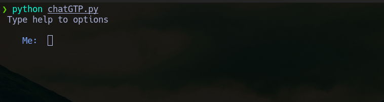
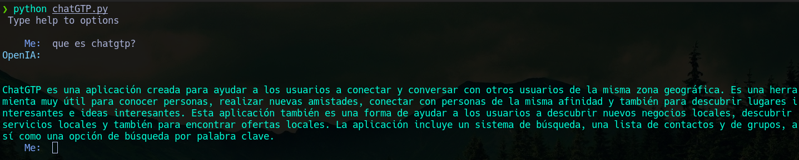

# Simple chat con ChatGPT usando python3

Es un simple programa en python para chatear mediante la terminal con chatgpt, tambien le implemente mediante la funcion `talk`  para que lea y reproduzca en audio la ultima respuesta. 

## Instalacion

```
git clone https://github.com/phrantom/chatGTP 
cd chatgpt
pip3 install -r requirements.txt
```

Luego solo faltaria editar el archivo chatGTP.py y agregar la api key de open ia. 
`openai.api_key = ""`

## Ejecutar

`python3 chatGTP.py`



## Opciones

Escribe help para desplegar las opciones:

**help:** Menu de ayuda.
**talk:** Lee la ultima respuesta reproduciendola en audio.
**engines:** - Listado de los distintos motores de openia. Para poder cambiarlos hay que editar el archivo chatGTP.py y modificar  la variable "engine" que por defecto es "text-davinci-003".
**exit** Salir del programa.


